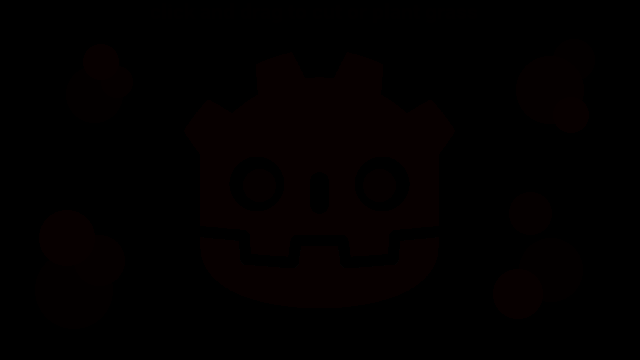
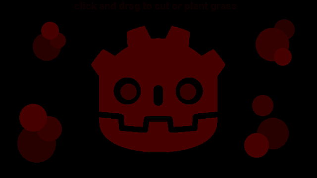
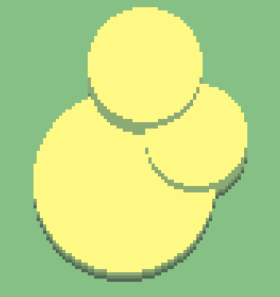
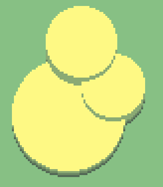
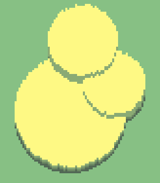
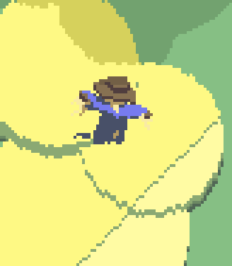

# 2D Grass

<div style="right:100px; position:relative" align="center"><iframe width="960px" height="540px" frameBorder="0" src="grass_shader.html"></iframe></div>

Grass in video games has always somewhat fascinated me. From the stubbly playing field in Rocket League to the long swaying grass in The Legend of Zelda: Breath of the Wild: well crafted grass is such an elementary detail and executing it well can, in my opinion, really sell the atmosphere of a game.

I had to start small, however, and decided to stick with 2D (especially as I'm stuck with my laptop, which does not have a GPU). And while I believe there is still much room for improvement, I think the result of my three-day holiday project is quite satisfying on its own.

## About

The complete Godot project is hosted on [GitHub](https://github.com/CaptainProton42/2DGrassShaderDemo). It is licensed under the MIT license so do with it whatever you want.

You can find me on Twitter ([@CaptainProton42](https://twitter.com/captainproton42)) and on Reddit ([/u/CaptainProton42](https://www.reddit.com/user/captainproton42)).

## Tutorial

I'll give a short rundown on how I implemented the grass shader in Godot.

### Base Texture

I decided to use the red channel of a texture as the base for my grass. While this approach may not be suitable for e.g. tile based games it allows great control over the shapes of the grass patches and the texture can be modified on runtime. In the example above, the initial texture looks like this:

<div align="center">

</div>

This may not look like much. However, if we increase the saturation, the above image will look like this:

<div align="center">

</div>

The integer value of the red channel corresponds to the height of the grass in pixels at that position (so a red value of 8 means that the single grass blade originating at this pixel position should be 8 pixels high).

We render this texture as a `TextureRect` to its own `Viewport` (*ViewportGrass*) so that it can be retreived by other shaders later.

A script is also attached to the `TextureRect` which allows the user to interact with the scene by drawing on the red channel of the texture and thus modifying the grass height at runtime. The same approach could also be used for player interaction by having the player "push down" the grass temporarily.

### The grass shader

Now that we have our base texture set up, we can move on to the main attraction: The grass shader itself.

Starting from the base texture, we want to create grass patches whose height corresponds to the base texture's red channel.

We do this by utilizing a fragment shader assigned to a fullscreen `ColorRect` where each pixel corresponds to a single blade.

We add a `uniform sampler2D` to the empty shader which can hold the `Viewport`'s texture from above as a `ViewportTexture`:

```
shader_type canvas_item;

uniform sampler2D tex;
```

The basic principle is then quite easy, actually:

```
void fragment() {
  vec2 uv = SCREEN_UV;
  COLOR = vec4(0.0f); // Start with clear color.
	for (float dist = 0.0f; dist < MAX_BLADE_LENGTH; ++dist) {		
		float blade_length = texture(tex, uv).r;
		
		if (blade_length > 0.0f) {
			if (dist == blade_length) {
				COLOR = tip_color;
			} else if (dist < blade_length) {
				COLOR = sampleColor(dist);
			}
		}
		
		uv -= vec2(0.0f, SCREEN_PIXEL_SIZE.y);
	}
}
```

Let's go through this step by step:
1. For each fragment (the pixel currently being drawn to by the shader), we loop through the pixels below it.
2. For each of these pixels, we read the grass height at their positions from the base texure.
3. We then check whether the grass is high enough to reach the original fragment 
    a. If so, we color the fragment.
    b. If not, we leave it alone.
    
By specifying a separate tip color (e.g. as an additional `uniform`) and a gradient for the grass blade "stem", we can give the blades a more distinct look. The result then looks like this:

<div align="center">

</div>

`sampleColor` just samples from the gradient by distance `dist` of the fragment to the blade origin.

Note that increasing `MAX_BLADE_LENGTH` requires more texture reads. Thus, longer grass (or, more precisely, more available distinctive lengths) will reduce performance. However, since we're dealing with a low resolution pixel art style here, using any non-excessive value should be fine. (This runs completely fine on my laptop's integrated graphics.)

And this is the basic principle of the shader. However, we may want to give it some live. I've always enjoyed looking at gusts of wind leaving "waves" in fields of grass so we're going to do that next.

### Gusts of wind

I've already compared the appearance of gusts to waves so we're going to do just this.

We add a few uniforms for specifying wind direction and speed and then define a superposition of some simple sine waves:

```
uniform float wind_speed;
uniform vec2 wind_direction;

float sineWave(float T, float a, float phase, vec2 dir, vec2 pos) {
	return a * sin(2.0f * PI / T * dot(dir, pos) + phase);
}

float wind (vec2 pos, float t) {
	return (sineWave(200.0f, 1.8f, 1.0f*wind_speed*t,
									 normalize(wind_direction), pos)
		      + sineWave(70.0f, 0.1f, 2.0f*wind_speed*t,
										 normalize(wind_direction - vec2(0.0f, 0.4f)), pos)
		      + sineWave(75.0f, 0.1f, 1.5f*wind_speed*t,
										 normalize(wind_direction + vec2(0.4f, 0.0f)), pos))
		     / 3.0f;
}
```

I found the above combination of three sine waves to be quite visually pleasing but you can adjust that to your tastes, of course.

We then modify the fragment shader as follows:

```
void fragment() {
  vec2 uv = SCREEN_UV;
	COLOR = vec4(0.0f);	
	for (float dist = 0.0f; dist < MAX_BLADE_LENGTH; ++dist) {	
		float wind = wind(uv / SCREEN_PIXEL_SIZE, TIME);	
		float blade_length = texture(tex, uv).r * 255.0f;
		
		if (blade_length > 0.0f) {
			if (wind > 0.5f) {
				blade_length -= 1.0f;
			}
			if (dist == blade_length) {
				if (wind <= 0.5f) {
					COLOR = tip_color;
				} else {
					COLOR = wind_color;
				}
			} else if (dist < blade_length) {
				COLOR = sampleColor(dist);
			}
		}
		
		uv -= vec2(0.0f, SCREEN_PIXEL_SIZE.y);
	}
}
```

Thus, if a grass blade is is hit by enough wind, it's length gets reduced by one pixel, creating the illusion of gusts pushing down the blades. We also color the corresponding blade tips in a lighter hue to increase the effect.

Our shader now looks like this:


We can also sample some noise over time and add it to the UV's y component in order to create the look of frayed grass. We should then also draw the base texture in the bottom color of the gradient below everything else in order remove the noisy fringes at the grass roots:

```
void fragment() {
  float noise = sampleNoise(UV, SCREEN_PIXEL_SIZE, 0.1f * wind_speed * TIME);
  vec2 uv = SCREEN_UV - vec2(0.0f, SCREEN_PIXEL_SIZE.y * noise);

  if (texture(tex, SCREEN_UV).r > 0.0f) {
		COLOR = sampleColor(0.0f);
	} else {
		COLOR = vec4(0.0f);
	}

	...
}
```

THe result is this:


### Clouds and shadows

To give the scene some more depth and demonstrate how the shader can interact with the environment, especially shadows, we can add some clouds (or at least their shadows).

For that, we use a separate `Viewport`, again, to which we render the cloud shadows.

For regular objects, we can then use a `Light2D` which uses a `ViewportTexture` and subtract mode. We could probably do the same for the grass and then modify its lighting shader but I decided to include this directly in the fragment shader for simplicity.

Adding the clouds in the fragment shader is easily done by adding the line

```
COLOR -= vec4(vec3(texture(cloud_tex, uv).r), 0.0f);
```

whenever drawing to a fragment.

The complete fragment shader now looks like this (without helper functions):

```
void fragment() {
  float noise = sampleNoise(UV, SCREEN_PIXEL_SIZE, 0.1f * wind_speed * TIME);
  vec2 uv = SCREEN_UV - vec2(0.0f, SCREEN_PIXEL_SIZE.y * noise);

  if (texture(tex, SCREEN_UV).r > 0.0f) {
    COLOR = sampleColor(0.0f);
    COLOR -= vec4(vec3(texture(cloud_tex, SCREEN_UV).r), 0.0f);
  } else {
    COLOR = vec4(0.0f, 0.0f, 0.0f, 0.0f);
  }

  for (float dist = 0.0f; dist < MAX_BLADE_LENGTH; ++dist) {
    float wind = wind(uv / SCREEN_PIXEL_SIZE, TIME);		
    float blade_length = sampleBladeLength(uv);

    if (blade_length > 0.0f) {
      if (wind > 0.5f) {
        blade_length -= 1.0f;
      }

      if (dist == blade_length) {
        if (wind <= 0.5f) {
          COLOR = tip_color;
        } else {
          COLOR = wind_color;
        }
        COLOR -= vec4(vec3(texture(cloud_tex, uv).r), 0.0f);
      } else if (dist < blade_length) {
        COLOR = sampleColor(dist);
        COLOR -= vec4(vec3(texture(cloud_tex, uv).r), 0.0f);
      }
    }
    uv -= vec2(0.0f, SCREEN_PIXEL_SIZE.y);
  }
}
```

### Additional Notes

Since the base texture is rendered to a separate `Viewport`, we can re-use the `Viewports`'s texture in other shader as well. Creating a material that hides portions of sprites behind grass is a good example of this. Look at this scarecrow for example:



This shader is relativey similar to the grass shader itself and is also included with the project.

## Conclusion

I hope this small writeup was somewhat helpful or at least interesting to you. You're welcome to leave feedback at my Twitter ([@CaptainProton42](https://twitter.com/captainproton42)) or directly in the issues on [GitHub](https://github.com/CaptainProton42/2DGrassShaderDemo/issues).