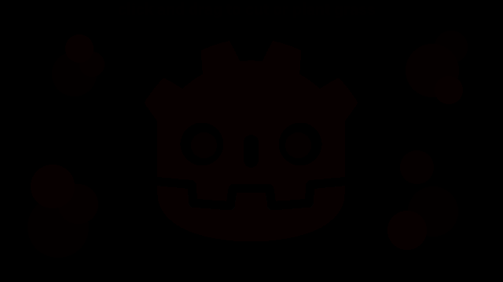

# 2D Grass

<div align="center"><iframe width="640px" height="360px" frameBorder="0" src="grass_shader.html"></iframe></div>

Click and drag to cut or regrow the grass. Adjust the length of the grass with the top left slider.

## What's so cool about grass?

Grass in video games has always somewhat fascinated me. From the soccer field in Rocket League to the swaying grass in Breath of the Wild, well crafted grass is such an elementary detail and executing it well can, in my oppinion, really sell the atmosphere of a game.

I had to start small, however, and decided to stick with 2D (especially as I'm stick with my laptop, which does not have a GPU). And while I believe there is still much room for improvement, I think the result of my three-day holiday project is quite satisfying on its own.

## About

The complete Godot project is hosted on [GitHub](https://github.com/CaptainProton42/2DGrassShaderDemo). It is licensed under the MIT license so do with it whatever you want, I guess.

You can find me on Twitter ([@CaptainProton42](https://twitter.com/captainproton42)) and on Reddit ([/u/CaptainProton42](https://www.reddit.com/user/captainproton42)).

## Tutorial

I'll give a short rundown on how I implemented the grass shader in Godot.

### Base Texture

I decided to use the red channel of a generic texture as a base for my grass. While this approach may not be suitable for e.g. tile based games, it allows great control over the shapes of the grass patches. In the example above, the initial texture looks like this:



This may not look like much. However, if we increase the saturation, the above image looks like this:


The 8-bit value of the red channel corresponds to the height of the grass in pixels at that position (so a red value of 8 means that the single grass blade originating at this pixel position should be 8 pixels high).

We render this texture as a `TextureRect` to its own `Viewport` (*ViewportGrass*) so that it can be retreived by other shaders later.

A script is also attached to the `TextureRect` which allows the user to interact with the scene by drawing to the red channel of the texture and thus modifying the grass height at runtime. This could also be used for player interaction by having the player "push down" the grass temporarily.

### The grass shader

Now that we have our base texture set up, we move on to the main attraction: The grass shader itself.

Starting from the base texture, we want to create grass patches whose height corresponds to the base texture's red channel, and sways somewhat in the wind.

We do this by utilizing a fragment shader where each pixel corresponds to a single blade:

We add a new `ColorRect` that spans the whole screen and add the `Viewport` from before as an input via a `ViewportTexture`:

```
uniform sampler2D tex;
```

The basic principle is then quite easy, actually:

```
void fragment() {
    COLOR = vec4(0.0f); // Start with clear color.
    vec2 uv = SCREEN_UV;
	for (float dist = 0.0f; dist < MAX_BLADE_LENGTH; ++dist) {		
		float blade_length = texture(tex, uv);
		
		if (blade_length > 0.0f) {
			if (dist == blade_length) {
				COLOR = tip_color;
			} else if (dist < blade_length) {
				COLOR = sampleColor(dist);
			}
		}
		
		uv -= vec2(0.0f, SCREEN_PIXEL_SIZE.y);
	}
}
```

Let's go through this step by step:
1. For each fragment (pixel currently being drawn to by the shader), we read the pixels below it.
2. For each of these pixels, we read the blade height at their positions from the base texure.
3. We then check whether the blade is hight enough to reach the original fragment 
    a. If so, we color the fragment.
    b. If not, we leave it alone.
    
By specifying a separate tip color (e.g. as an additional `uniform`) and a gradient for the blade "stem", we can give the blades a more distinct look. The result then looks like this:


`sampleColor` just samples from the gradient by distance `dist` of the fragment to the blade origin.

Note that increasing `MAX_BLADE_LENGTH` requires more texture reads. Thus, longer grass (or, more precisely, more available distinctive lengths) will reduce performance. However, since we're dealing with a low resolution pixel art style here, using any non-excessive value should be fine. (This runs completely fine on my laptop's integrated graphics.)

And this is the basic principle of the shader. However, we may want to give it some live. I've always enjoyed looking at gusts of wind leaving "waves" in fields of grass so we're going to do that next.

### Gusts of wind

I've already compared the appearance of gusts to waves so we're going to do just this.

We add a few uniforms for specifying wind direction and speed and then define a superposition of some simple sine waves:

```
uniform float wind_speed;
uniform vec2 wind_direction;

float sineWave(float T, float a, float phase, vec2 dir, vec2 pos) {
	return a * sin(2.0f * PI / T * dot(dir, pos) + phase);
}

float wind (vec2 pos, float t) {
	return (sineWave(200.0f, 1.8f, 1.0f*wind_speed*t, normalize(wind_direction), pos)
		   + sineWave(70.0f, 0.1f, 2.0f*wind_speed*t, normalize(wind_direction - vec2(0.0f, 0.4f)), pos)
		   + sineWave(75.0f, 0.1f, 1.5f*wind_speed*t, normalize(wind_direction + vec2(0.4f, 0.0f)), pos))
		   / 3.0f;
}
```

I found the above combination of three sine waves to be quite visually pleasing but you can adjust that to your tastes, of course.

We then modify the fragment shader as follows:

<pre><code>
void fragment() {
    COLOR = vec4(0.0f); // Start with clear color.
    vec2 uv = SCREEN_UV;
    for (float dist = 0.0f; dist < MAX_BLADE_LENGTH; ++dist) {		
        <a style="background-color:yellow;">float wind = wind(uv / SCREEN_PIXEL_SIZE, TIME);</a>

        float blade_length = texture(tex, uv);

		if (blade_length > 0.0f) {
            if (wind > 0.5f) {
				blade_length -= 1.0f;
			}

			if (dist == blade_length) {
				if (wind <= 0.5f) {
					COLOR = tip_color;
				} else {
					COLOR = wind_color;
				}
			} else if (dist < blade_length) {
				COLOR = sampleColor(dist);
			}
		}
		
		uv -= vec2(0.0f, SCREEN_PIXEL_SIZE.y);
	}
}
</code></pre>

Thus, if a grass blade is is hit by enough wind, it's length gets reduced by one pixel, creating the illusion of gusts pushing down the blades. We also color the corresponding blade tips in a lighter hue to increase the effect.